# pulumi-aws-eks-hello-world-demo

A demo project showing how to provision an Amazon EKS cluster on AWS using Pulumi, with a VPC, subnets, IAM roles, and the AWS Load Balancer Controller. Includes a simple “Hello World” Kubernetes application exposed via Gateway API and Kong Gateway.

This demo aim to give you a step by step hand holding guide that you can follow.

What we will have at the end:


# pre-requsite

- Pulumi
- uv


# Project Setup

uv sync
source .venv/bin/activate

# AWS 

Configure you aws

You can configure any ways you want as long as you know the profile that has a connection.

Export the profile

`export AWS_PROFILE="<YOUR_PROFILE_NAME>"`

Run aws sts get-caller-identity --profile <profile name>

You would get something like that:
```bash
{
    "UserId": "BXO3165...ZP36NYY5FOU:my-session",
    "Account": "9263...9123",
    "Arn": "arn:aws:sts::9263...9123:assumed-role/.../my-session"
}
```

Set you profile for pulumi to use here [pulumi/Pulumi.dev.yaml](pulumi/Pulumi.dev.yaml)


# Pulumi
```bash
cd pulumi
pulumi login
pulumi stack init dev
pulumi up
```

You should be able to see the progress in your cli.

or you can view the online dashboard which I found to be really good compared to some of the other iac tools.

You can track all the updates to your stacks and a graph view that shows you the relationship between resources.

Standing the infra takes around 10-15 minutes.

Once finished, you shuld see a an aws cluster named `my-eks-cluster-*` if you visit the aws dashboard.

You might need to manually confgirue the kubeconfig for access to your cluster, to do so, run:
```bash
aws eks update-kubeconfig --region <region> --name <cluster-name> --profile <profile>
```

To quickly check you have access to the cluster locally, run

`kubectl get pod` and you should expect the `No resources found in default namespace.` message since we have not deployed anything yet.

# Deploying Our Hellow World APp

I have made a very simple hello world app which you can find inside the [src](src) folder. It's a single page web app that just says hello world run by a flask server.

Nothing special there, feel free to poke around though.

You can try running it locally if you want.

On the project root, run:

`python src/app.py`

You should see

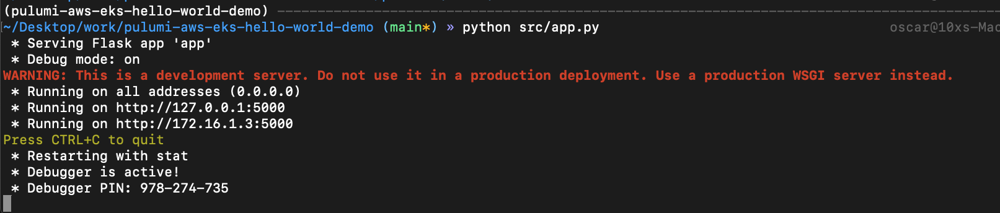

Try to reach it on your browser: [http://localhost:5000/ui](http://localhost:5000/ui)

This is what you should see

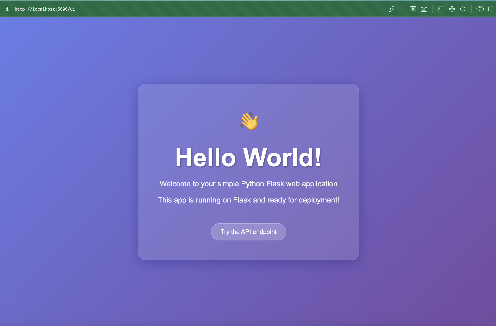

Cool, let's build a docker image and push it to our ecr.

## Building And Pushing To ECR

There should be a ecr named `my-eks-cluster-hello-world` provisioned which you can view on the aws dashboard.

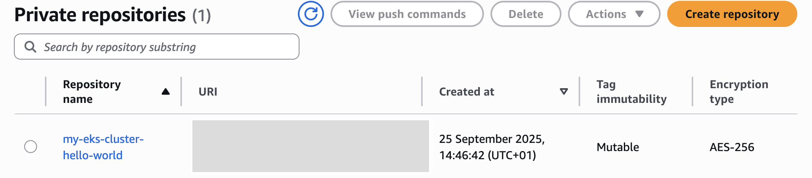

There is a [Dockerfile](Dockerfile) which you can use to build the hello world app image.

To do it, we will need to autheticate docker to our ecr.

Inside the pulumi folder,

Run on your terminal, put in your region and profile name:
```bash
aws ecr get-login-password --region <your-region> --profile <your-profile-name> | docker login --username AWS --password-stdin $(pulumi stack output ecrRepositoryUrl | cut -d'/' -f1)
```
You should see message saying `Login Succeeded` after.

Next, build and push the image to our ecr.

To do that run:

```bash
docker buildx build --platform linux/amd64 -t $(pulumi stack output ecrRepositoryUrl) .. --push
```

You should see our image with the latest tag on the ecr after.

## Deploy The App On OUr Cluster

If you look into our [k8s/hello_world](k8s/hello_world/), you should find 3 files there, [deployment.yaml](k8s/hello_world/deployment.yaml), [service.yaml](k8s/hello_world/service.yaml) and [http_route.yaml](k8s/hello_world/http_route.yaml). Ignore the [http_route.yaml](k8s/hello_world/http_route.yaml) for now. 

Within our [deployment.yaml](k8s/hello_world/deployment.yaml), we have our pod definition and we need to put our image uri which you can find and copy one the aws dashboard.

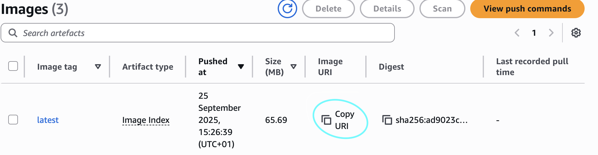

Copy and paste the uri on [line 17](k8s/hello_world/deployment.yaml#17) in our [deployment.yaml](k8s/hello_world/deployment.yaml).

[service.yaml](k8s/hello_world/service.yaml) defines the internal service (cluster ip) to our deployment which is our hello world app.

When you are ready to deploy, on the project root run:

```bash
kubectl apply -f k8s/hello_world/deployment.yaml -f k8s/hello_world/service.yaml
```

To view our deployment and service, just run:

```bash
kubectl get pods
```

And we should see two replicas of our deployments.

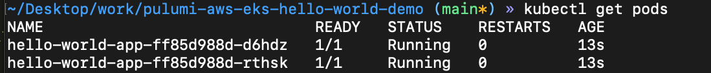

We can do the same for the service, run:

```bash
kubectl get svc
```

And we should see a internal service of type cluster ip for our hellow world app deployment.

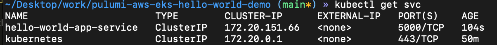

Let's do port-forward to see if the app is running like we are expecting it. If you have taken a look at [pulumi/infra/eks.py](pulumi/infra/eks.py#52), you should see `endpoint_public_access` is set to True so we can use kubectl to port-forward it, if it's false, then we won't be able to do it without first having a way to be inside our vpc first.

Since we have enable `endpoint_public_access`, let's port-forward it:
```bash
kubectl port-forward svc/hello-world-app-service 5000:5000
```

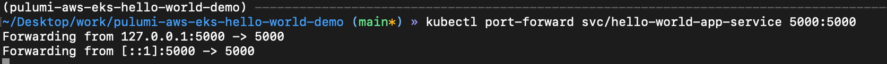

We should be able to reach it on [http://localhost:5000/ui](http://localhost:5000/ui) and see the same ui as we saw when we ran the flask app locally on our machine earlier.

Cool, everything working as expected so far, we can stop the port-forward.

What if we need to expose it to be reachable via the internet using http/htttps?

# Exposing Our Service To The Internet

There are a ton of different ways you can do this, for example, using k8s ingress or gateway api.

We will go with gateway api in this demo which is a newer Kubernetes API for traffic routing, intended as a more expressive and extensible successor to Ingress.

At the time of this demo wwas created, [k8s Ingress](https://kubernetes.io/docs/concepts/services-networking/ingress/) was at v1.19 and it's frozen.

You will want to learn more about [k8s Gateway API](https://kubernetes.io/docs/concepts/services-networking/gateway/) soon or later.

I won't spend too much time explaining what gateway api is and the different components we need to make it work, if you are intereted in it, you can check out my [k8s-gateway-api-demo](https://github.com/osw282/k8s-gateway-api-demo).

We will be using the [kong gateway operator](https://developer.konghq.com/operator/dataplanes/get-started/kic/install/) as the GatewayClass implemenation.

## Deploying Gateway API

Inside the [k8s/gateway_api/](k8s/gateway_api/) folder, you will find 5 diffeernt manifests there.

Gateway API requiest a minimum of 3 resources to work
- [GatewayClass](k8s/gateway_api/gateway_class.yaml) # Inside [k8s/gateway_api/](k8s/gateway_api/)
- [Gateway](k8s/gateway_api/gateway.yaml) # Inside [k8s/gateway_api/](k8s/gateway_api/)
- [HTTPRoute](k8s/hello_world/http_route.yaml) or a `GRPCRoute` # Inside [k8s/hello_world/](k8s/hello_world/)

We also have 3 additional manifest that will help us to set up our gateway api:
- [k8s/gateway_api/namespace.yaml](k8s/gateway_api/namespace.yaml)
- [k8s/gateway_api/gateway_config.yaml](k8s/gateway_api/gateway_config.yaml)
- [k8s/gateway_api/reference_grant.yaml](k8s/gateway_api/reference_grant.yaml)

Again, I won't go through what each one of them do here, I have explained the purposed of each and why there are here on my [k8s-gateway-api-demo](https://github.com/osw282/k8s-gateway-api-demo) repo.

Let's go ahead and apply them, on the project root:

### 1. Install Kong Gateway Operator with Ingress Controller

I recommend you to visit kong's getting started page and follow their insturctions to install it.

[Install Kong Gateway Operator with Kong Ingress Controller](https://developer.konghq.com/operator/dataplanes/get-started/kic/install/)

If you can't be bothered, just copy the below blocks, which should install the latest version at the time of this blog is written 25-Sep-2025 of Kong Gaeway Operator:
```bash
# Install the gateway crds
kubectl apply -f https://github.com/kubernetes-sigs/gateway-api/releases/download/v1.3.0/standard-install.yaml

# Install Kong Gateway Operator using helm charts
helm repo add kong https://charts.konghq.com
helm repo update

helm upgrade --install kgo kong/gateway-operator -n kong-system --create-namespace \
  --set image.tag=1.6.1 \
  --set kubernetes-configuration-crds.enabled=true \
  --set env.ENABLE_CONTROLLER_KONNECT=true

# Wait for kong gateway operator to be ready
kubectl -n kong-system wait --for=condition=Available=true --timeout=120s deployment/kgo-gateway-operator-controller-manager
```

If you run:
```bash
kubectl get pods -n kong-system
```

You should see
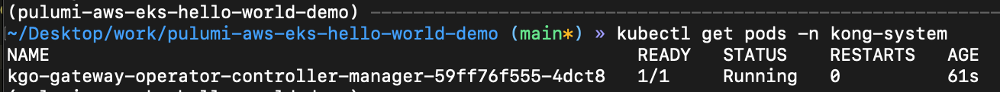

### 2. Creating a name space for kong

```bash
kubectl apply -f k8s/gateway_api/namespace.yaml
```

### 3. Creating a configuration for kong's data plane and control plane

```bash
kubectl apply -f k8s/gateway_api/gateway_config.yaml
```

### 4. Createing the kong gateway class

```bash
kubectl apply -f k8s/gateway_api/gateway_class.yaml
```

### 5. Createing the gateway

```bash
kubectl apply -f k8s/gateway_api/gateway.yaml
```

### 6. Creating a reference grant

```bash
kubectl apply -f k8s/gateway_api/reference_grant.yaml
```

To check if kong's data and control plane is running, wait for them to be ready:

```bash
kubectl get pods -n kong
```

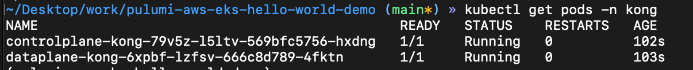

By now, we should already have an external ip address that we can reach, we can verify by running

```bash
kubectl get svc -n kong
```

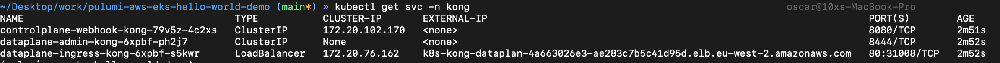

We can see there is a external ip associated with our kong load balancer service.

We can also visit the load balancer page on the aws dashboard.

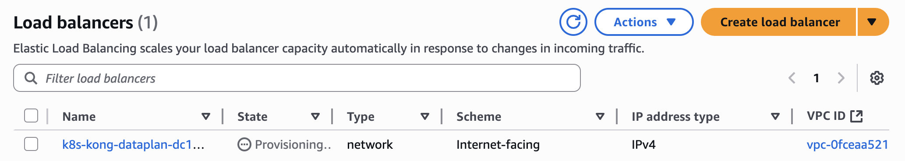

Wait for it to provision and you should see the state to become "Active".

Now, we should be able to reach our app with the external ip.

## Create a HTTP route for our hello world app

Now that we have kong all setup with gateway api.

We can define a route for our hello world deplpyment

From the project root, run:

```bash
kubectl apply -f k8s/hello_world/http_route.yaml
```

To check that it has successfull created

```bash
kubectl get httproute -n kong
```

We should see

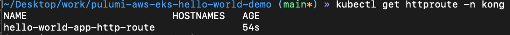

Run the following command to give you the full url to reach our hello world app.

```bash
echo "http://$(kubectl get svc -n kong -o jsonpath='{.items[?(@.spec.type=="LoadBalancer")].status.loadBalancer.ingress[0].hostname}')/ui"
```

We did it..

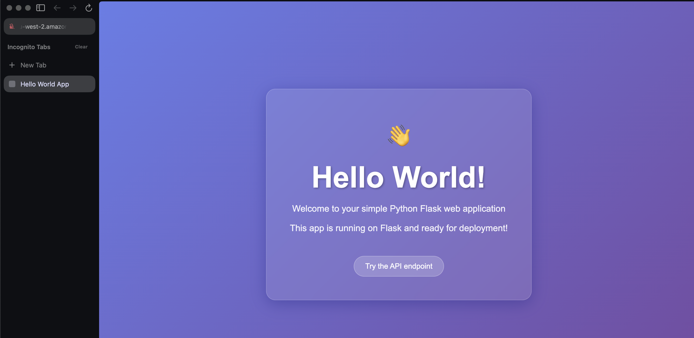

We have a publicly reachable app.

I really hope you find this demo useful, of course we just deployed a webapp that just says hello world which have no use in the real world.

But the knowledge and set up is transferable to set up your complex machine learning system.

# What's Next

## HTTPS

There are two ways we can set up https with kong.

If you remeber, inside our [k8s/gateway_api/gateway_config.yaml](k8s/gateway_api/gateway_config.yaml), kong can only have either a NLB or a CLB, CLB is outdated and should not be used anymore, so we went with a internet facing NLB.

But NLB is layer 4, support tcp but not http or https. So what do we do?

### Let kong do the work, we keep NLB at the front

Well you are right, but even if Kong is fronted by an NLB, you can still reach your services over HTTPS because:
- the NLB is just **passing raw TCP** (port 443) to Kong.

- Kong terminates the TLS connection itself using the certificate you configure.

- From the browser’s perspective, it’s still a normal HTTPS endpoint (valid cert etc).

So the flow will look like this:

```bash
Browser (HTTPS request on port 443)
    ↓
AWS NLB (forwards TCP:443, no TLS termination)
    ↓
Kong Gateway (terminates TLS using cert from K8s Secret)
    ↓
Backend Service
```

As long as Kong is configured with a valid cert (self-signed, Let’s Encrypt via cert-manager, or one you upload), your browser will connect via HTTPS with no issue.

Which ever way you should to get a tls certificate is really your choice, but you will need a domain.

### We put a ALB in front of kong

If you put an ALB in front, then the ALB could terminate TLS itself (certs live in ACM) and Kong would just see plain HTTP.

That means Kong doesn’t need to expose a public-facing LoadBalancer at all.

With ALB:

- The ALB is becomes the external entrypoint.
- ALB terminates TLS and forwards plain HTTP to Kong.
- Kong only needs to be reachable inside the cluster, so ClusterIP is enough.
- Which you can set via annotation in [k8s/gateway_api/gateway_config.yaml](k8s/gateway_api/gateway_config.yaml)

This is also a pretty common design in setups where teams want AWS-native TLS + WAF at the edge, while still keeping Kong as the API gateway inside.

My recommendation is that you start simple, and add in the services as you required.

# Clean Up

To bring down our cluster, we can jsut run 
```bash
pulumi destroy
```